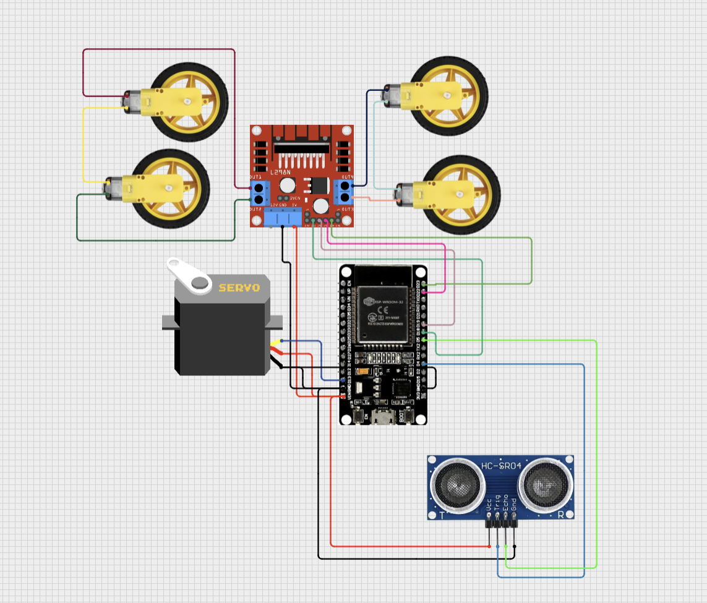

<h1>หุ่นยนต์วิ่งอัตโนมัติ</h1>

<h2>อุปกรณ์ที่ใช้:</h2>
<ul>
  <li>สายไฟจัมเปอร์</li>
  <li>บอร์ด ESP32</li>
  <li>HC-SR04 เซนเซอร์วัดระยะ</li>
  <li>บอร์ดควบคุมมอเตอร์</li>
  <li>มอเตอร์</li>
  <li>Servo</li>
</ul>

</img>

<h2>หลักการทำงาน:</h2>
 เมื่อเริ่มกดปุ่ม หุ่นยนต์ตัวนี้จะเริ่มวิ่งทันที และถ้าเซนเซอร์ เจอวัตถุที่อยู่ข้างหน้า จะหยุดทันทีและ 
 หมุนเพื่อหาระยะทาง โดย Servo เพื้อให้ เซนเซอร์วัดระยะ จะเริ่มหมุนหันซ้าย แล้วหมุนไปทางขวา 
 ถ้าฝั่งไหนมีระยะทางมากกว่า จะหมุนไปทางที่มีระยะทางมากกว่า ถ้าเจอทางตัน 
 จะหมุนกลับหลังไปยังทางเดิม และถ้ากดปุ่มอีกครั้ง หุ่นยนต์ตัวนี้จะหยุดทันที

<h2>สิ่งที่ได้เรียนรู้:</h2>
เข้าใจการทำงานหุ่นยนต์แบบเบื้องต้น การรับข้อมูลจากเซนเซอร์ และการวางเซ็นเซอร์ให้ได้เหมาะสมที่สุด
